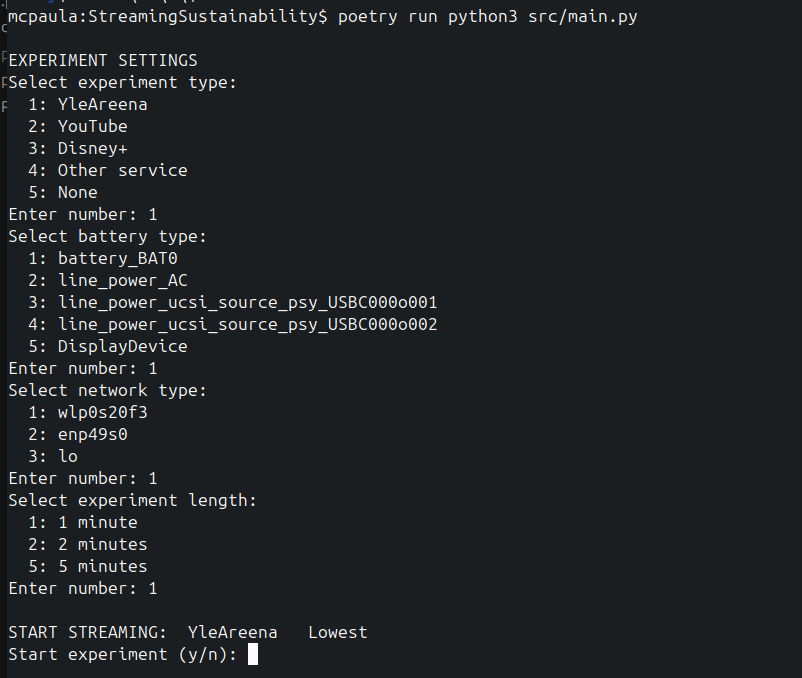
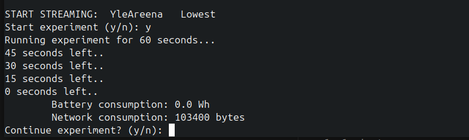
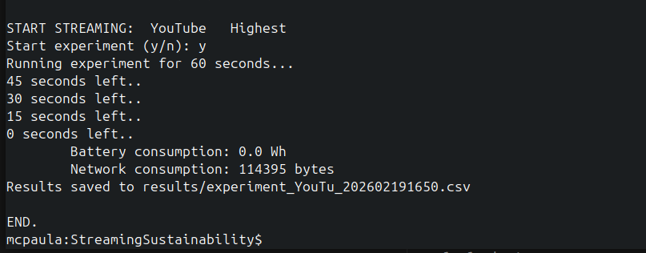

# User manual

## Run program
After setting up poetry environment start program with shell command

    poetry run python3 src/main.py

## Experiment settings

First you are prompted options for experiment type (streaming service), battery type, network type and experiment length.

## Recording experiments

Then the application instructs you to do 3 recordings of different streaming resolutions.

    START STREAMING  Service  Lowest

Set up selected streaming experiment in lowest resolution with full screen and leave it playing.

Return to the application and  press y to start recording values for that resolution.

    Start experiment (y/n): y

After the time is over, battery and network consumption values are shown.

You can continue to the middle resolution experiment by selecting y or end the experiment by selecting n.

    Continue experiment (y/n): y

After the middle resolution experiment, you can then continue to highest resolution and repeat same steps.

If you discontinue after any recording by selecting n, the data of all recorded resolutions is saved on a csv file, which name is provided on the screen.

## Note on recorded values

This application retrieves network consumption data from the counter of the network interface on Linux.

Battery consumption is the energy value retrieved from the battery interface. Notice that the power charger does not provide this information.

In case these values are not available the application will not start.

## Fixed settings

You can find dictionary lists for experiment types, resolution types and length options on top of settings.py. Battery and network options are queried by the app from the operating system.
